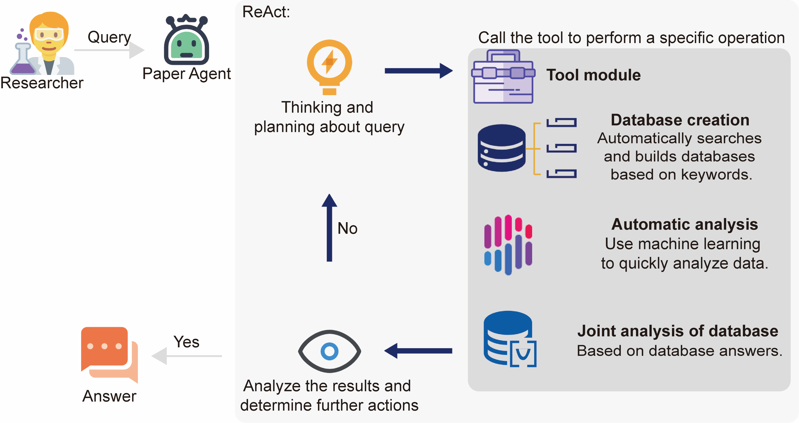
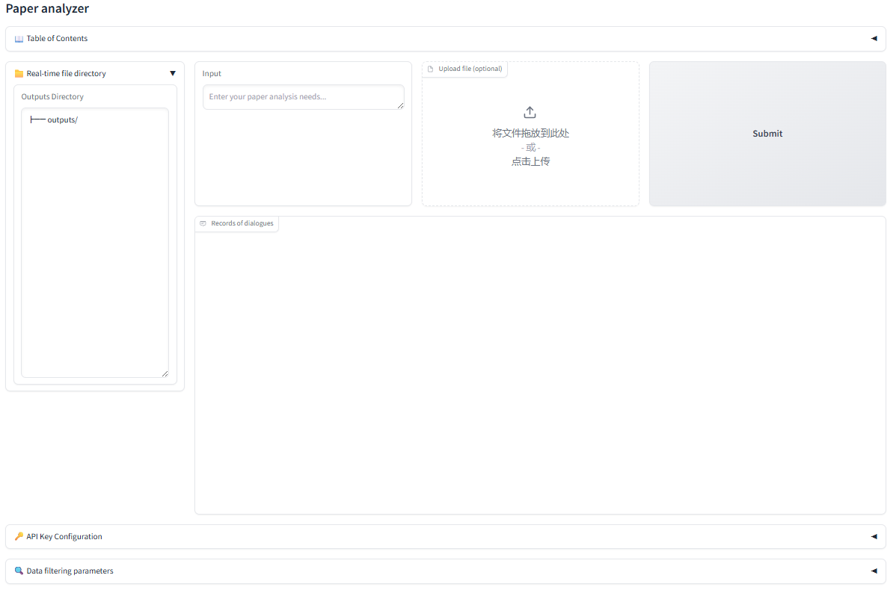

# LLMs-powered chemist agent reveals the synthesis–property relationships in semiconductor TiO2 nanocomposites
## 🙌About
This repository contains the code and resources of the following paper:

LLMs-powered chemist agent reveals the synthesis–property relationships in semiconductor TiO2 nanocomposites

## 📕Overview of the agent
TiO2 nanocomposites are widely used in photocatalysis, photovoltaics, and optical devices, yet their synthesis process–property relationships (PPR) remain poorly understood due to data scarcity. Here, we present Paper Agent, a large language model (LLM)-powered chemist agent for end-to-end data collection and analysis. Leveraging Structured ChemPrompt Engineering and integrated modules for database creation, automatic analysis, and joint database interrogation, Paper Agent autonomously extracted 4000 structured data points from the literature. Using a fine-tuned qwen-14b-grpo model, it achieved an F1 score of 0.7503, enabling fast, cost-effective, and accurate data extraction. Automated regression and SHAP analysis revealed key factors influencing material properties, while joint database analysis enabled reverse design of synthesis routes. Notably, multi-tool integration gives rise to emergent capabilities, mimicking expert reasoning. This work demonstrates a novel AI-driven strategy to uncover PPR in energy-relevant TiO2 nanocomposites and accelerate materials discovery.

 

## 🔧Setup environment
Setup the required environment using `environment.yml` with Anaconda. While in the project directory run:

    conda env create -f environment.yml

Activate the environment

    conda activate paperagent
    
    pip install torch==2.2.2 torchvision==0.17.2 torchaudio==2.2.2 --index-url https://download.pytorch.org/whl/cu118

## 🟨Files

Paper Agent-main/  
├── functions  
├── images    
├── prompts  
├── prompts_comparison  
├── train_grpo    
├── train_sft     
├── LINCENSE    
├── README.md    
├── agent.ipynb     
├── app.py  
├── bot.png   
├── environment.yaml    
├── tools.py  
├── user.png   
├── Modelfiles   
└── ...              
## 🗝️TDM permission application

Browse these websites:

    API key application:
        Elsevier: https://www.elsevier.com/about/open-science/research-data/text-and-data-mining
        Wiley: https://onlinelibrary.wiley.com/ library-info/resources/text-and-datamining
        Springer Nature: https://dev.Springer-nature.com
    
    IP:
        Royal Society of Chemistry: https://www.rsc.org/journals-books-databases /research-tools/text-and-data-mining
        American Chemical Society: https://solutions.acs.org/solutions/text-and-data-mining

## 👋Applying other LLMs

Browse these websites:

    aliyun: https://bailian.console.aliyun.com/?spm=5176.29619931.J__Z58Z6CX7MY__Ll8p1ZOR.1.25b4521c2XMKq7&tab=home#/home
    doubao: https://www.volcengine.com/product/doubao?from=doubao_product_page  
    grok: https://console.x.ai/team/a76e9ec8-0511-4dd6-b532-124a6cf24efe    
    deepseek: https://api-docs.deepseek.com/    

qwen-14b-grpo deployment:

    Need Ollama: https://ollama.com/ llama.cpp: https://github.com/ggml-org/llama.cpp

    Download model files: https://huggingface.co/renquan/qwen-14b-grpo

Execute the command:

    python llama.cpp/convert_hf_to_gguf.py output/lora_merged --outfile output/gguf_model --outtype fp16

    ollama start
    ollama create modelname --file Modelfile
    ollama run modelname
    Over: ctrl + c

## 🚀Paper Agent via Gradio

Execute the command:

    cd your_download_path\Paper Agent-main
    python app.py

 

## Paper Agent via jupyterlab

Execute the command:

    cd agent.ipynb

## Example.1 Daily dialogue

https://github.com/user-attachments/assets/199d4ab9-b50f-4875-b869-57a2e155ca83

## Example.2 Database creation and clean

https://github.com/user-attachments/assets/5b6f598d-964f-425f-8a75-02212e5c5425

## Example.3 Database analysis

https://github.com/user-attachments/assets/b9e4054b-211d-4a47-b0d0-94340d9128b2

## Example.4 Automatic data analysis

https://github.com/user-attachments/assets/4d3fa333-f6ec-46d8-899a-f87b470c1f6c

    
## License
Paper Agent is licensed under the Apache License, Version 2.0: http://www.apache.org/licenses/LICENSE-2.0.

## Citation

comming soon.....

