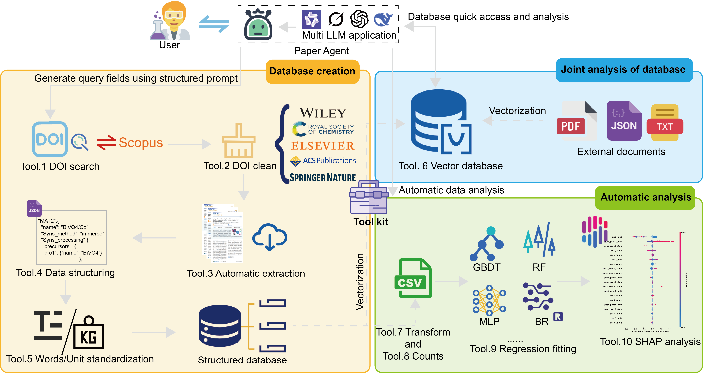
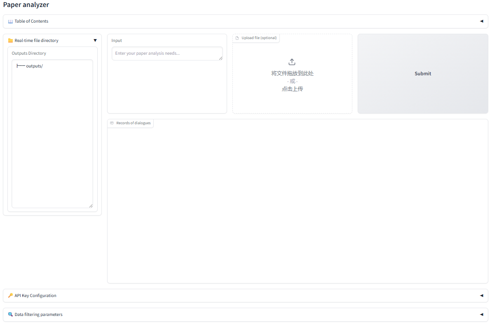

# Paper Agent: a large language models powered agent for end-to-end data collection and analysis of TiO2 nanocomposites
## 🙌About
This repository contains the code and resources of the following paper:

Paper Agent: a large language models powered agent for end-to-end data collection and analysis of TiO2 nanocomposites

## 📕Overview of the agent
Data scarcity is a significant bottleneck for applying Artificial Intelligence (AI) in the field of TiO2 nanocomposites. To address this, we developed “Paper Agent”, a Large Language Models (LLMs) powered agent for end-to-end automatic data collection and analysis. Equipped with modules for database creation, joint analysis of database and automatic data analysis and carefully designed Structured ChemPrompt Engineering, Paper Agent streamlines the research workflow.

 

## 🔧Setup environment
Setup the required environment using `environment.yml` with Anaconda. While in the project directory run:

    conda env create -f environment.yml

Activate the environment

    conda activate paperagent
    
    pip install torch==2.2.2 torchvision==0.17.2 torchaudio==2.2.2 --index-url https://download.pytorch.org/whl/cu118

## 🟨Files

Paper Agent-main/  
├── agent.ipynb  
├── app.py   
├── bot.png     
├── clean_datanase.py  
├── create_database.py  
├── data_analysis.py    
├── data_count.py     
├── data_extract.py    
├── model_sel.py    
├── shapplot.py  
├── Toc.png  
├── tools.py    
├── user.png    
├── vector_store.py   
├── train.py    
├── prompts  
├── README.md   
├── Modelfiles   
└── ...              
## 🗝️TDM permission application

Browse these websites:

    API key application:
        Elsevier: https://www.elsevier.com/about/open-science/research-data/text-and-data-mining
        Wiley: https://onlinelibrary.wiley.com/ library-info/resources/text-and-datamining
        Springer Nature: https://dev.Springer-nature.com
    
    IP:
        Royal Society of Chemistry: https://www.rsc.org/journals-books-databases /research-tools/text-and-data-mining
        American Chemical Society: https://solutions.acs.org/solutions/text-and-data-mining

## 👋Applying other LLMs

Browse these websites:

    aliyun: https://bailian.console.aliyun.com/?spm=5176.29619931.J__Z58Z6CX7MY__Ll8p1ZOR.1.25b4521c2XMKq7&tab=home#/home
    doubao: https://www.volcengine.com/product/doubao?from=doubao_product_page  
    grok: https://console.x.ai/team/a76e9ec8-0511-4dd6-b532-124a6cf24efe    
    deepseek: https://api-docs.deepseek.com/    

qwen-14b-grpo deployment:

    Need Ollama: https://ollama.com/ llama.cpp: https://github.com/ggml-org/llama.cpp

    Download model files: https://huggingface.co/renquan/qwen-14b-grpo

Execute the command:

    python llama.cpp/convert_hf_to_gguf.py output/lora_merged --outfile output/gguf_model --outtype fp16

    ollama start
    ollama create modelname --file Modelfile
    ollama run modelname
    Over: ctrl + c

## 🚀Paper Agent via Gradio

Execute the command:

    cd your_download_path\Paper Agent-main
    python app.py

 

## Paper Agent via jupyterlab

Execute the command:

    cd agent.ipynb

## Example.1 Daily dialogue

## Example.2 Database creation and clean

## Example.3 Database analysis

## Example.4 Automatic data analysis
    
## License
Paper Agent is licensed under the Apache License, Version 2.0: http://www.apache.org/licenses/LICENSE-2.0.

## Citation

comming soon.....